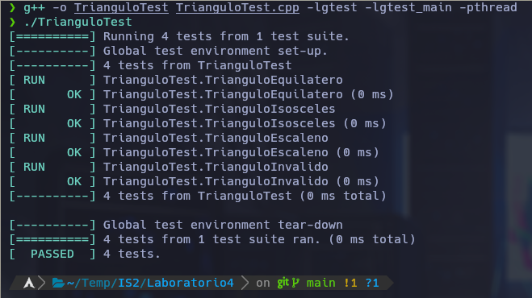

# Laboratorio 04

## Por: Paul Antony Parizaca Mozo

## Ejecución:

### 1.- Clonar el repositorio:
```
cd googletest
mkdir build
cd build
cmake ..
make
```

### 2.- Compilar y ejecutar:

```
g++ -o TrianguloTest TrianguloTest.cpp -lgtest -lgtest_main -pthread
./TrianguloTest
```


