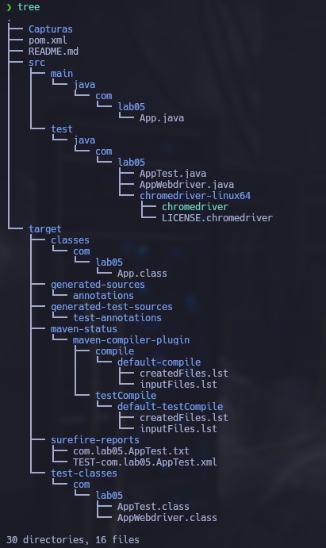
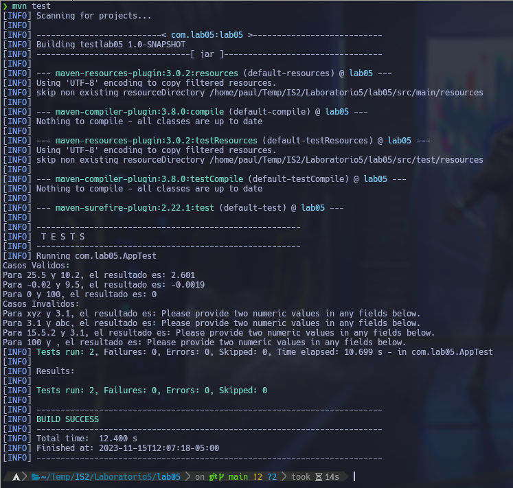

# Laboratorio 05

Por: Paul Parizaca Mozo


## Estructura del Proyecto



## Casos de Prueba - Estrategia de Clases de Equivalencia:

La Estrategia de Clases de Equivalencia es una técnica de diseño de pruebas
utilizada en pruebas funcionales, y específicamente en pruebas de caja negra
(black box). El objetivo principal de esta estrategia es dividir el conjunto 
de datos de entrada en clases o conjuntos que compartan características
similares, y luego seleccionar un representante de cada clase para ser probado
. Esto ayuda a reducir el número de casos de prueba necesarios para cubrir un
rango más amplio de situaciones.

| Escenario de Prueba | Valores de Prueba          | Resultado Esperado   |
|----------------------|----------------------------|----------------------|
| Valor Válido Positivo | % = "25.5", n = "10.2"      | 2.601                |
| Valor Válido Negativo | % = "-0.02", n = "9.5"      | -0.0019              |
| Valor Válido Nulo     | % = "0", n = "100"          | 0                    |
| Valor Inválido (no numéricos) | % = "xyz", n = "3.1" | Manejo de error(1)   |
| Valor Inválido (no numéricos) | % = "3.1", n = "abc" | Manejo de error(1)   |
| Valor Inválido (formato inválido) | % = "15.5.2", n = "3.1" | Manejo de error(1)   |
| Valor Inválido (nulo) | % = "100", n = "null"     | Manejo de error(1)   |

## AppTest
```java
package com.lab05;

import org.openqa.selenium.WebDriver;
import org.openqa.selenium.chrome.ChromeDriver;
import junit.framework.TestCase;

public class AppTest extends TestCase {
    private WebDriver driver;

    @Override
    protected void setUp() {
        System.setProperty("webdriver.chrome.driver", "src/test/java/com/lab05/chromedriver-linux64/chromedriver");
        driver = new ChromeDriver();
    }

    public void testValidCases(){
        String[][] CasosValidos = {
            {"25.5", "10.2", "2.601"},
            {"-0.02", "9.5", "-0.0019"},
            {"0", "100", "0"},
        };
        System.out.println("Casos Validos: ");
        for (String[] testCase : CasosValidos){
            String result = AppWebdriver.calculatePercentage(driver, testCase[0], testCase[1]);
            System.out.println("Para " + testCase[0] + " y " + testCase[1] + ", el resultado es: " + result);
            assertEquals(testCase[2], result.trim());
        }
    }

    public void testInvalidCases(){
        String[][] CasosInvalidos = {
            {"xyz", "3.1", "Please provide two numeric values in any fields below."},
            {"3.1", "abc", "Please provide two numeric values in any fields below."},
            {"15.5.2", "3.1", "Please provide two numeric values in any fields below."},
            {"100", "", "Please provide two numeric values in any fields below."},
        };
        System.out.println("Casos Invalidos: ");
        for (String[] testCase : CasosInvalidos){
            String result = AppWebdriver.calculatePercentageWrong(driver, testCase[0], testCase[1]);
            System.out.println("Para " + testCase[0] + " y " + testCase[1] + ", el resultado es: " + result);
            assertEquals(testCase[2], result.trim());
        }
    }
    @Override
    protected void tearDown() {
        if (driver != null) {
            driver.quit();
        }
    }
}
```

## AppWebdriver
```java
package com.lab05;

import org.openqa.selenium.By;
import org.openqa.selenium.WebDriver;
import org.openqa.selenium.WebElement;

public class AppWebdriver {
    public static String calculatePercentage(WebDriver driver, String firstValue, String secondValue) {
        driver.get("https://www.calculator.net/percent-calculator.html");
        WebElement firstNumber = driver.findElement(By.id("cpar1"));
        firstNumber.sendKeys(firstValue);
        WebElement secondNumber = driver.findElement(By.id("cpar2"));
        secondNumber.sendKeys(secondValue);
        WebElement calculateButton = driver.findElement(By.xpath("//input[@value='Calculate']"));
        calculateButton.click();
        WebElement resultElement = driver.findElement(By.cssSelector("font[color='green']"));
        return resultElement.getText();
    }
    public static String calculatePercentageWrong(WebDriver driver, String firstValue, String secondValue) {
        driver.get("https://www.calculator.net/percent-calculator.html");
        WebElement firstNumber = driver.findElement(By.id("cpar1"));
        firstNumber.sendKeys(firstValue);
        WebElement secondNumber = driver.findElement(By.id("cpar2"));
        secondNumber.sendKeys(secondValue);
        WebElement calculateButton = driver.findElement(By.xpath("//input[@value='Calculate']"));
        calculateButton.click();
        WebElement errorElement = driver.findElement(By.cssSelector("font[color='red']"));
        return errorElement.getText();
    }
}
```
## Ejecucion
```
mvn test

```




